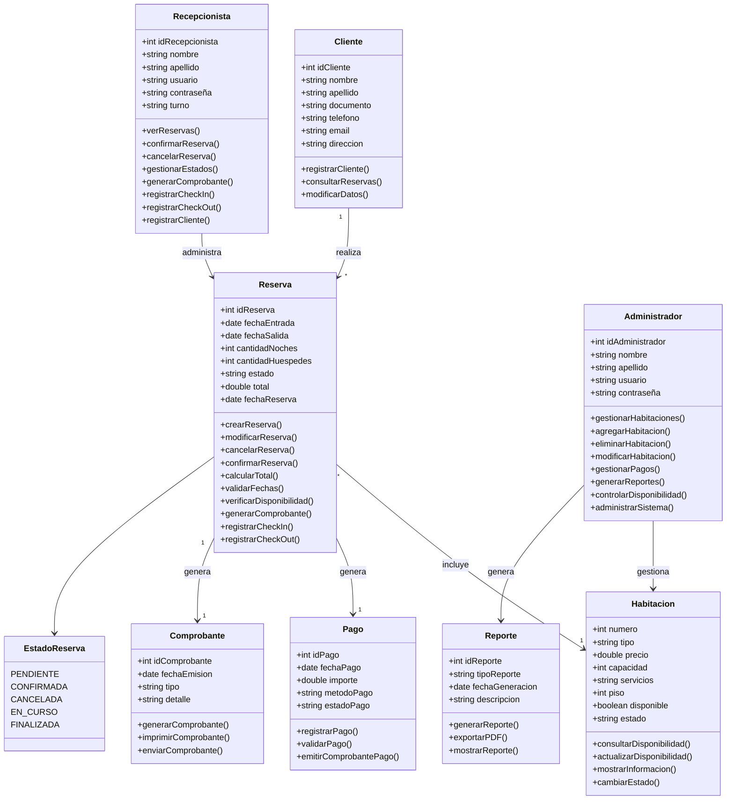

# Diagrama de Clases - Sistema de Gestión Hotelera



## Descripción

Este diagrama representa un sistema de gestión hotelera donde:

* Un cliente puede realizar múltiples reservas.
* Cada reserva corresponde a una habitación.
* Cada reserva genera un pago.
* Cada reserva genera un comprobante.
* El recepcionista administra las reservas.
* El administrador gestiona habitaciones y reportes.
* El estado de una reserva puede ser: pendiente, confirmada, cancelada, en curso o finalizada.

## Tecnologías sugeridas

* Lenguaje: Java
* Base de datos: PostgreSQL
* UML: Mermaid
* Control de versiones: Git y GitHub

```
```
